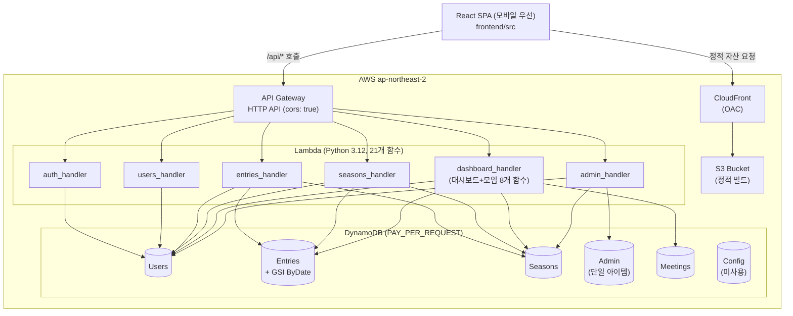
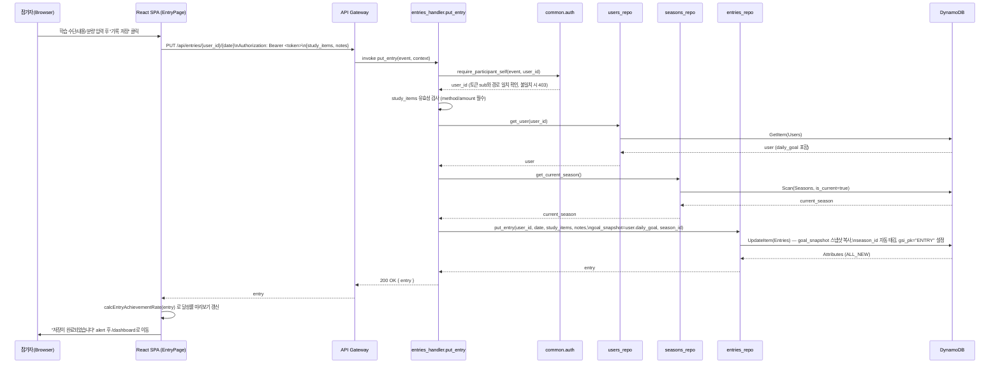

# System Architecture

## System Overview

Study Planner는 완전 서버리스 아키텍처다. 상시 구동되는 서버가 없고, React SPA는 S3+CloudFront로 정적 호스팅되며, 모든 API 요청은 API Gateway HTTP API를 거쳐 Python 3.12 Lambda 함수(21개, 엔드포인트 1:1 매핑)에서 처리된다. 데이터는 DynamoDB 6개 테이블(PAY_PER_REQUEST 과금)에 저장된다. 10명 이하, 하루 단위 기록이라는 트래픽 특성상 콜드스타트/동시성 이슈가 실질적으로 없다고 설계 문서에 명시되어 있으며, 실제로 Lambda `memorySize: 256`, `timeout: 10`으로 매우 가볍게 설정되어 있다(`serverless.yml:10-11`). 배포는 GitHub Actions가 `main` 브랜치 push 시 2단계(backend → frontend)로 자동 수행한다.

## Architecture Diagram

## Component Descriptions

### backend/handlers (Lambda 엔트리포인트)
- **Purpose**: API Gateway 이벤트를 받아 인가 검사 → 요청 파싱 → repo/domain 호출 → 응답 변환을 수행하는 얇은 진입점.
- **Responsibilities**: `auth_handler`(참가자 로그인), `users_handler`(목록/PIN/목표), `entries_handler`(학습 기록 CRUD), `seasons_handler`(시즌 조회/시즌 대시보드), `dashboard_handler`(주간/월간/모임/피드 — 모임 CRUD까지 이 파일에 포함), `admin_handler`(관리자 인증 및 참가자/시즌 관리).
- **Dependencies**: `backend/common`(auth, errors, request, responses, time_utils), `backend/domain`(순수 계산), `backend/repos`(DynamoDB 접근).
- **Type**: Application (Lambda function handlers)

### backend/domain (순수 함수 계산 계층)
- **Purpose**: 날짜/타임존/집계처럼 버그가 나기 쉬운 로직을 I/O 없는 순수 함수로 분리해 유닛 테스트 가능하게 한다.
- **Responsibilities**: `achievement.py`(달성률 계산), `dashboard.py`(참가자별 요약 조립, 그룹 합산 없음), `dday.py`(D-day 계산), `periods.py`(주간/월간/모임 회차 구간 계산).
- **Dependencies**: 없음(표준 라이브러리만).
- **Type**: Application (domain logic)

### backend/repos (DynamoDB 접근 계층)
- **Purpose**: 각 테이블에 대한 순수 I/O 함수 제공, 비즈니스 규칙(goal_snapshot 채움 등)은 포함하지 않음.
- **Responsibilities**: `users_repo`, `entries_repo`, `seasons_repo`(TransactWriteItems로 시즌 전환 원자성 보장), `admin_repo`, `meetings_repo`.
- **Dependencies**: `backend/common/db.py`(boto3 리소스/클라이언트 캐싱).
- **Type**: Application (data access)

### backend/common (공통 유틸)
- **Purpose**: 인증/에러 처리/응답 포맷/시간 계산을 모든 핸들러가 공유.
- **Responsibilities**: `auth.py`(bcrypt 해시, JWT 발급/검증, 참가자·관리자 role 분리 인가), `errors.py`(`handle_errors` 데코레이터로 예외→HTTP 상태 매핑), `db.py`(boto3 리소스 캐싱), `request.py`/`responses.py`(API Gateway v2 payload 파싱/응답), `time_utils.py`(KST 고정 타임존).
- **Dependencies**: boto3, PyJWT, bcrypt.
- **Type**: Application (shared library)

### frontend (React + TypeScript SPA)
- **Purpose**: 모바일 우선 반응형 UI로 4개 화면(로그인/개인 기록/대시보드/관리자)을 제공.
- **Responsibilities**: `api/client.ts`(REST 호출 래퍼), `auth.ts`(참가자/관리자 세션 완전 분리), `achievement.ts`(백엔드 달성률 로직의 프론트 미러), `pages/*`(화면별 로직 및 폼 상태), `components/DdayBanner.tsx`.
- **Dependencies**: react-router-dom, Vite 빌드 시스템. 상태관리 라이브러리 없음(React 기본 상태 + fetch).
- **Type**: Application (SPA)

### infra (Serverless Framework)
- **Purpose**: 전체 AWS 리소스를 코드로 정의하고 배포.
- **Responsibilities**: `serverless.yml`(리포 루트 위치 — 핸들러 경로 해석을 위해 필수)이 Lambda 21개, DynamoDB 6개, API Gateway HTTP API, S3+CloudFront(OAC)를 정의. `infra/package.json`은 Serverless CLI만 devDependency로 관리.
- **Dependencies**: AWS 자격증명(GitHub Secrets), `serverless` 3.x CLI.
- **Type**: Infrastructure (Serverless Framework / CloudFormation 기반)

### .github/workflows/deploy.yml (CI/CD)
- **Purpose**: `main` push 시 백엔드 → 프론트엔드 순차 자동 배포.
- **Responsibilities**: Python 의존성을 리포 루트에 `--platform manylinux2014_x86_64 --only-binary=:all:`로 설치(bcrypt C 확장 호환), `serverless deploy`, CloudFormation 출력값을 `describe-stacks --query`로 직접 조회, 프론트 빌드 시 `VITE_API_URL` 주입 후 S3 sync + CloudFront invalidation.
- **Dependencies**: AWS_ACCESS_KEY_ID/AWS_SECRET_ACCESS_KEY/JWT_SECRET (GitHub Secrets).
- **Type**: CI/CD pipeline

## Data Flow

### 시퀀스: 참가자가 하루 학습 기록을 저장하는 흐름 (`PUT /api/entries/{user_id}/{date}`)

## Integration Points

- **External APIs**: 없음 — 외부 서드파티 API 연동 없음(SES, SNS, OAuth 등 전혀 사용하지 않음).
- **Databases**: DynamoDB 단일 종류, 테이블 6개(Users/Admin/Seasons/Entries/Config/Meetings). `Entries`에 GSI `ByDate`(PK 상수 `"ENTRY"`, SK `date`)로 전체 유저 기간 조회를 지원.
- **Third-party Services**: 없음. JWT 서명은 자체 `JWT_SECRET`(AWS와 무관한 랜덤 값)을 GitHub Secrets로 관리하며 Cognito 등 인증 서비스는 사용하지 않는다.

## Infrastructure Components

- **CDK Stacks**: 사용하지 않음 — Serverless Framework(CloudFormation 기반)로 대체. CloudFormation 스택명 `study-planner-prod`.
- **Deployment Model**: 완전 서버리스, 단일 리전(ap-northeast-2), 단일 스테이지 운영(`prod`), 리소스명에 스테이지 접두사(`study-planner-${stage}-*`)를 붙여 향후 스테이지/그룹 분리에 대비. 커스텀 도메인 없이 CloudFront 기본 URL 사용.
- **Networking**: VPC 구성 없음(Lambda가 DynamoDB/외부 서비스와 통신할 필요가 VPC 내부 자원에 국한되지 않으므로 서버리스 관리형 네트워킹만 사용). API Gateway HTTP API에 `cors: true`(모든 오리진 허용 — 코드 품질 평가서에서 상세 지적).
