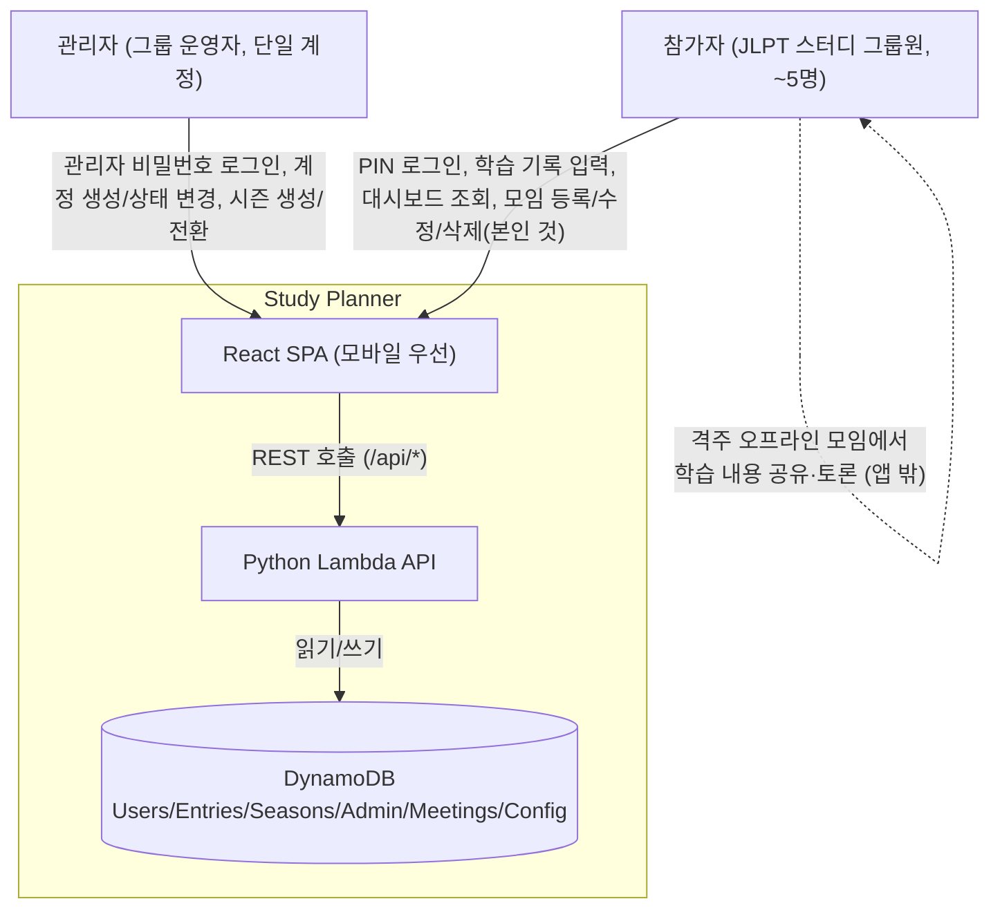

# Business Overview

## Business Context Diagram

## Business Description

- **Business Description**: Study Planner는 10명 이하 소규모 스터디 그룹(현재 실사용 그룹은 일본어 JLPT 급수 취득을 목표로 하는 5명 내외 어학 스터디)을 위한 학습 이력 기록/공유 도구다. 참가자는 매일 자신이 학습한 수단(인강/문제집/단어암기/모의고사 등)별로 학습 내용과 분량을 기록하고, 그룹 대시보드에서 서로의 참여 현황(기록 여부, 개인별 목표 달성률)을 공유한다. 이 도구의 목적은 성과를 관리/강제하는 것이 아니라 **공유를 촉진**하는 것이며, 그룹이 실제로 갖고 있는 격주 오프라인 모임 관행을 디지털로 보조한다. 목표(하루 학습량)는 참가자 개인이 자율적으로 설정하며 그룹 공통 목표는 강제하지 않는다. 학습 데이터는 시즌(예: "2026년 12월 JLPT N2 대비") 단위로 구분되어, 같은 급수에 여러 차례 재도전하는 경우를 지원한다.

- **Business Transactions**:
  1. **참가자 로그인 (PIN 인증)** — 사용자 선택 드롭다운에서 이름을 고르고 4자리 PIN을 입력해 단기 토큰(JWT, TTL 12시간)을 발급받는다 (`POST /api/auth/verify`).
  2. **PIN 변경** — 로그인한 참가자가 본인 PIN을 스스로 변경한다 (`PUT /api/users/{user_id}/pin`).
  3. **목표 설정/조회** — 참가자가 수단별 하루 학습 목표(예: 인강 30분, 문제집 10페이지)를 설정하거나 조회한다 (`GET/PUT /api/users/{user_id}/goal`).
  4. **학습 기록 작성/조회/수정/삭제** — 참가자가 특정 날짜에 수단별 학습 항목(내용/분량)과 메모를 기록한다. 저장 시점의 목표가 `goal_snapshot`으로 함께 저장되어 이후 목표 변경이 과거 기록에 소급 반영되지 않는다 (`GET/PUT/DELETE /api/entries/{user_id}/{date}`).
  5. **그룹 대시보드 조회** — 주간/월간/시즌 전체/오프라인 모임 회차별로 참가자별 기록 건수와 달성률(%)을 조회한다. 그룹 전체 합산이 아니라 항상 참가자 개인별 수치다 (`GET /api/dashboard/weekly|monthly|season/{id}|meetings`).
  6. **공유 메모 피드 조회** — 기간 내 참가자들이 남긴 학습 메모(notes)를 최신순으로 조회한다 (`GET /api/dashboard/feed`).
  7. **오프라인 모임 등록/수정/삭제** — 로그인한 참가자 누구나 실제 모임 날짜와 메모를 등록/수정할 수 있고, 삭제는 등록한 본인만 가능하다 (`POST/PUT/DELETE /api/meetings*`).
  8. **시즌 조회** — 참가자가 시즌 목록/현재 시즌 정보(시험일 D-day 포함)를 조회한다 (`GET /api/seasons`, `/api/seasons/current`).
  9. **관리자 로그인** — 참가자와 완전히 분리된 단일 관리자 계정이 비밀번호로 로그인해 관리자 전용 토큰(TTL 2시간)을 발급받는다 (`POST /api/admin/auth/verify`).
  10. **참가자 계정 생성/상태 변경 (관리자)** — 관리자가 신규 참가자 계정(초기 PIN 포함)을 생성하거나 기존 참가자를 `active`/`inactive`로 전환한다 (`POST /api/admin/users`, `PATCH /api/admin/users/{user_id}`).
  11. **시즌 생성/전환 (관리자)** — 관리자가 신규 시즌을 만들고, 특정 시즌을 현재 시즌(`is_current=true`)으로 원자적으로 전환한다 (`POST /api/admin/seasons`, `PATCH /api/admin/seasons/{season_id}/activate`).

- **Business Dictionary**:
  - **참가자(Participant/User)**: 스터디에 실제로 참여하는 그룹원. `Users` 테이블에 저장되며 `status`(active/inactive)로 활동 여부를 관리한다.
  - **관리자(Admin)**: 참가자와 완전히 분리된 단일 운영 계정. 계정/시즌 관리만 담당하며 스터디에 직접 참여하지 않는다.
  - **학습 수단(method)**: 학습 방식 구분(인강/문제집/단어암기/모의고사 등, 자유 입력 가능). 하루 기록은 수단별로 나뉘어 저장된다.
  - **학습 내용(topics)**: 수단 내에서 다룬 세부 주제(문법/어휘/한자/청해/독해 등).
  - **학습량(amount)**: `{value, unit}` 형태의 수단별 분량. unit은 사람/기록/수단마다 다를 수 있어 그룹 합산에 쓰이지 않는다.
  - **목표(daily_goal / goal_snapshot)**: 참가자가 자율적으로 설정하는 수단별 하루 목표. `goal_snapshot`은 기록 시점의 목표를 그대로 복사한 값으로, 목표가 나중에 바뀌어도 과거 달성률에 영향을 주지 않는다.
  - **달성률(achievement_rate)**: `amount`와 `goal_snapshot`으로 읽기 시점에 계산하는 파생값(%). 단위가 다르면 그 수단은 계산에서 제외, 계산 가능한 수단이 하나도 없으면 `null`(목표 미설정으로 표기).
  - **시즌(Season)**: 특정 시험 회차를 겨냥한 스터디 기간 단위. 동시에 하나만 `is_current=true`일 수 있다.
  - **D-day**: 현재 시즌의 시험일(`exam_date`)까지 남은 일수. 능동 알림이 아니라 접속 시에만 보이는 정보성 배너.
  - **오프라인 모임(Meeting)/회차(round)**: 실제로 열린(또는 예정된) 그룹 모임. 고정 주기를 가정하지 않고 등록된 날짜 순서로 회차 번호를 매긴다. 미래 모임은 회차 집계에서 제외되고 "예정된 모임"으로만 표시된다.
  - **미수행자(not_participated)**: 해당 기간에 기록이 0건인 활성 참가자. 압박 대신 담백한 표기를 지향한다.

## Component Level Business Descriptions

### backend (Python Lambda API)
- **Purpose**: 참가자/관리자 인증, 학습 기록 CRUD, 목표/달성률 계산, 대시보드 집계, 시즌/모임 관리 등 모든 서버 측 비즈니스 로직을 수행한다.
- **Responsibilities**: PIN/비밀번호 검증과 JWT 발급, DynamoDB 데이터 접근, 순수 함수 기반 집계(달성률/기간/D-day) 계산, 요청별 인가(본인 확인 vs 참가자 전체 허용 vs 관리자 전용) 판단.

### frontend (React + TypeScript SPA)
- **Purpose**: 참가자가 모바일 환경에서 쉽게 기록을 남기고 그룹 현황을 확인할 수 있는 4개 화면(로그인, 개인 기록, 그룹 대시보드, 관리자)을 제공한다.
- **Responsibilities**: PIN/관리자 인증 세션을 완전히 분리해서 관리, 수단별 학습량 입력 UX(시간/분수/고정단위/자유단위), 달성률을 백엔드와 동일한 로직으로 화면에 미리 계산해 보여주는 것(`achievement.ts`), 오프라인 모임 회차 아코디언 뷰와 등록자 본인 확인 기반 삭제 버튼 노출.

### infra (Serverless Framework IaC)
- **Purpose**: API Gateway + Lambda + DynamoDB + S3/CloudFront로 구성된 완전 서버리스 인프라를 코드로 정의하고 GitHub Actions를 통해 자동 배포한다.
- **Responsibilities**: DynamoDB 테이블 6개(Users/Admin/Seasons/Entries/Config/Meetings) 및 GSI 정의, Lambda 함수 21개와 API Gateway HTTP API 라우팅 정의, S3 정적 호스팅 + CloudFront(OAC) 배포, IAM 최소 권한(그룹 내에서는 AdministratorAccess로 완화 운영 중).
