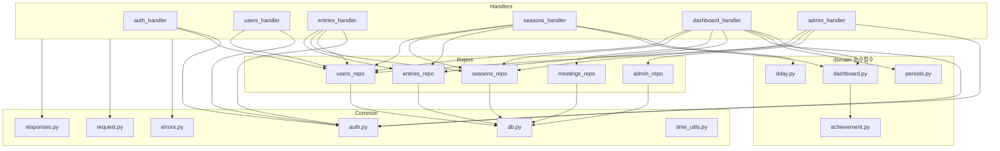

# Code Structure

## Build System

- **Type**: 혼합 — Python(pip, 빌드 도구 없음, 패키징은 Serverless Framework의 `package.patterns`), Node/npm(frontend는 Vite, infra는 Serverless CLI만 관리).
- **Configuration**:
  - `backend/requirements.txt` — pip 의존성 3개(boto3, PyJWT, bcrypt).
  - `frontend/package.json` + `frontend/vite.config.ts` — Vite 5 + React 플러그인, `tsc && vite build`로 타입체크 후 빌드.
  - `infra/package.json` — `serverless` 3.x만 devDependency로 관리, 스크립트는 `serverless deploy --stage prod|dev`.
  - `serverless.yml`(리포 루트) — Lambda 패키징 시 `package.patterns`로 `frontend/**`, `docs/**`, `prototype-sheets/**`, `infra/**`, `.github/**`, `backend/tests/**`를 제외.
  - Python 의존성은 로컬 `venv`가 아니라 CI에서 리포 루트에 직접 설치(`pip install -t .`)하여 Lambda 패키징 루트와 `sys.path`를 일치시키는 특이한 구조 — `infra/CLAUDE.md`에 문서화됨.

## Key Classes/Modules

### Existing Files Inventory

**backend/**
- `backend/__init__.py` — 패키지 마커, 내용 없음.
- `backend/common/__init__.py` — 패키지 마커.
- `backend/common/auth.py` — bcrypt 해시/검증, JWT 발급(참가자 TTL 12시간/관리자 TTL 2시간), `require_participant`/`require_participant_self`/`require_admin` 인가 헬퍼.
- `backend/common/db.py` — boto3 `resource()`/`client()` 모듈 레벨 캐싱, `table(env_var_name)` 헬퍼.
- `backend/common/errors.py` — `handle_errors` 데코레이터: `AuthError`→401/403, `ValueError`→400, 그 외 예외→로깅 후 500.
- `backend/common/request.py` — API Gateway HTTP API v2 payload에서 body/pathParameters/queryStringParameters 파싱.
- `backend/common/responses.py` — 200/201/204/400/401/403/404/500 JSON 응답 빌더, `Decimal` 직렬화 처리.
- `backend/common/time_utils.py` — KST(UTC+9) 고정 `now_kst()`/`today_kst_str()`/`now_kst_iso()`.
- `backend/domain/__init__.py` — 패키지 마커.
- `backend/domain/achievement.py` — `calc_achievement_rate`(단일 수단), `calc_entry_achievement_rate`(하루치 평균), `average_achievement_rate`(기간 평균, 개인 전용) 순수 함수.
- `backend/domain/dashboard.py` — `build_participant_summary`, `not_participated`, `build_dashboard`(참가자별 요약 리스트, 그룹 합산 없음).
- `backend/domain/dday.py` — `calc_dday(exam_date, today)`.
- `backend/domain/periods.py` — `week_range_from_iso`, `week_range_containing`, `meeting_rounds`(모임 회차/구간 계산), `month_range_from_str`, `month_range_containing`.
- `backend/handlers/__init__.py` — 패키지 마커.
- `backend/handlers/admin_handler.py` — 관리자 로그인/참가자 계정 생성·상태변경/시즌 생성·활성화 5개 엔드포인트.
- `backend/handlers/auth_handler.py` — 참가자 PIN 검증 1개 엔드포인트.
- `backend/handlers/dashboard_handler.py` — 주간/월간/피드/모임 CRUD 4종/모임 회차 대시보드까지 총 8개 엔드포인트(파일명과 달리 모임 CRUD까지 포함해 책임이 다소 큼).
- `backend/handlers/entries_handler.py` — 학습 기록 CRUD 4개 엔드포인트.
- `backend/handlers/seasons_handler.py` — 시즌 목록/현재 시즌/시즌 대시보드 3개 엔드포인트.
- `backend/handlers/users_handler.py` — 유저 목록/PIN 변경/목표 조회·설정 4개 엔드포인트.
- `backend/repos/__init__.py` — 패키지 마커.
- `backend/repos/admin_repo.py` — `Admin` 테이블 get/upsert(단일 아이템).
- `backend/repos/entries_repo.py` — `Entries` 테이블 get/query(본인)/query(GSI ByDate 전체)/upsert/delete.
- `backend/repos/meetings_repo.py` — `Meetings` 테이블 scan/get/create/update/delete.
- `backend/repos/seasons_repo.py` — `Seasons` 테이블 scan/get/get_current(scan+filter)/create/activate(TransactWriteItems).
- `backend/repos/users_repo.py` — `Users` 테이블 get/scan(active)/scan(all, 미사용)/create/update_status/update_pin/set_goal.
- `backend/scripts/seed_admin.py` — 관리자 계정 최초 생성/재설정 겸용 대화형 CLI(idempotent upsert), 배포 파이프라인에는 미포함.
- `backend/tests/__init__.py` — 패키지 마커.
- `backend/tests/test_achievement.py` — 달성률 계산 유닛 테스트 9종.
- `backend/tests/test_dashboard.py` — 참가자 요약/미수행자 판정 유닛 테스트 2종.
- `backend/tests/test_dday.py` — D-day 계산 유닛 테스트 3종.
- `backend/tests/test_periods.py` — 주간/모임 회차/월간 범위 계산 유닛 테스트 5종.
- `backend/requirements.txt` — boto3/PyJWT/bcrypt 버전 핀.

**frontend/src/**
- `frontend/src/main.tsx` — React 엔트리포인트, `BrowserRouter`로 `App` 마운트(내용은 표준 보일러플레이트).
- `frontend/src/App.tsx` — 라우팅 정의(`/`, `/entry`, `/dashboard`, `/admin`), `RequireParticipant` 가드.
- `frontend/src/achievement.ts` — 백엔드 `calc_entry_achievement_rate` 로직을 TypeScript로 미러링(표시 미리보기용).
- `frontend/src/auth.ts` — 참가자/관리자 세션을 완전히 분리된 localStorage 키로 저장.
- `frontend/src/types.ts` — 전체 도메인 타입 정의(Entry, Season, ParticipantSummary, MeetingRoundSummary 등).
- `frontend/src/vite-env.d.ts` — Vite 환경변수 타입 선언.
- `frontend/src/api/client.ts` — 모든 REST 호출 래퍼 함수 + `ApiError` 클래스.
- `frontend/src/components/DdayBanner.tsx` — D-day 배너 컴포넌트(exam_date 없으면 렌더링 안 함).
- `frontend/src/pages/LoginPage.tsx` — 사용자 선택 + PIN 입력 화면.
- `frontend/src/pages/EntryPage.tsx` — 개인 기록 입력/조회, 목표 설정, PIN 변경(아코디언 3종) — 555줄로 가장 큰 컴포넌트.
- `frontend/src/pages/DashboardPage.tsx` — 그룹 대시보드(주간/모임/월간/시즌 탭), 모임 등록/수정/삭제 UI 포함.
- `frontend/src/pages/AdminPage.tsx` — 관리자 로그인 + 계정 생성/상태변경/시즌 생성/전환 폼 4종.

## Design Patterns

### Decorator 기반 에러 처리
- **Location**: `backend/common/errors.py`의 `handle_errors`, 모든 핸들러 함수에 적용.
- **Purpose**: 매 핸들러마다 try/except를 반복하지 않고 `AuthError`/`ValueError`/기타 예외를 일관된 HTTP 응답으로 변환.
- **Implementation**: `functools.wraps`로 감싼 데코레이터가 `AuthError.status`(401/403), `ValueError`(400), 나머지는 로깅 후 500을 반환.

### Repository 패턴
- **Location**: `backend/repos/*.py`.
- **Purpose**: DynamoDB 접근을 핸들러/도메인 로직과 분리해 테이블별로 캡슐화. `backend/CLAUDE.md`에 "DynamoDB 접근 로직은 핸들러와 분리해 재사용 가능한 모듈로 둔다"고 명시.
- **Implementation**: 각 repo 모듈이 `_table()` 헬�퍼로 boto3 Table 객체를 얻고, get/list/create/update/delete 함수를 노출. 비즈니스 규칙(goal_snapshot 채우기 등)은 repo가 아니라 핸들러가 여러 repo를 조합해 처리(`entries_handler.put_entry`가 대표 사례).

### 순수 함수 도메인 계층
- **Location**: `backend/domain/*.py`.
- **Purpose**: 날짜 range 계산, KST 타임존 처리, 달성률 평균 같은 버그가 나기 쉬운 로직을 I/O 없는 순수 함수로 분리해 유닛 테스트 가능하게 함(`backend/CLAUDE.md` 원칙과 일치, 실제로 4개 domain 모듈 모두 대응하는 테스트 파일 보유).
- **Implementation**: 모든 domain 함수가 dict/list/str/date 등 기본 타입만 인자로 받고 부작용 없이 값을 반환. "오늘 날짜"가 필요한 계산(`meeting_rounds`)조차 인자로 받아 순수성을 유지하고, 필터링 책임을 호출자(핸들러)에게 위임.

### 토큰 기반 역할 분리 인가 (Role-scoped Auth)
- **Location**: `backend/common/auth.py`.
- **Purpose**: 참가자 토큰과 관리자 토큰이 서로의 엔드포인트를 호출할 수 없도록 JWT `role` 클레임으로 스코프 분리.
- **Implementation**: `issue_participant_token`/`issue_admin_token`이 각각 `role: "participant"`/`"admin"` 클레임을 심고, `require_participant`/`require_admin`이 `role` 불일치 시 403을 던짐. `require_participant_self`는 추가로 토큰의 `sub`(user_id)와 경로 파라미터 일치를 검사.

### Thin Handler 패턴
- **Location**: `backend/handlers/*.py`.
- **Purpose**: "핸들러 하나당 하나의 책임(엔드포인트)"(`backend/CLAUDE.md`) — Lambda 콜드스타트 최적화와 유지보수 용이성.
- **Implementation**: 대부분의 핸들러 함수가 15줄 내외로, 인가 → 파싱/검증 → repo 호출 → 응답 변환의 4단계만 수행. 예외적으로 `dashboard_handler.py`는 대시보드 4종 + 모임 CRUD 5종을 한 파일에 몰아넣어 "하나의 책임" 원칙이 파일 단위에서는 다소 느슨해짐(함수 단위로는 유지).

## Critical Dependencies

### boto3
- **Version**: `1.34.*` (`backend/requirements.txt:1`)
- **Usage**: 모든 `backend/repos/*.py`와 `backend/common/db.py`에서 DynamoDB 리소스/클라이언트로 사용.
- **Purpose**: AWS SDK, DynamoDB CRUD/Query/Scan/TransactWriteItems 수행.

### PyJWT
- **Version**: `2.8.*` (`backend/requirements.txt:2`)
- **Usage**: `backend/common/auth.py`의 `_encode`/`_decode`.
- **Purpose**: 참가자/관리자 세션 토큰(JWT, HS256) 발급 및 검증.

### bcrypt
- **Version**: `4.1.*` (`backend/requirements.txt:3`)
- **Usage**: `backend/common/auth.py`의 `hash_secret`/`verify_secret` — PIN과 관리자 비밀번호 공용.
- **Purpose**: 비밀정보 해시 저장. C 확장 포함 패키지라 Lambda(Amazon Linux) 배포 시 `--platform manylinux2014_x86_64 --only-binary=:all:` 강제가 필요(`infra/CLAUDE.md`, `.github/workflows/deploy.yml:34-39`).

### react / react-dom
- **Version**: `^18.3.1` (`frontend/package.json`)
- **Usage**: 전체 SPA UI.
- **Purpose**: 컴포넌트 기반 렌더링.

### react-router-dom
- **Version**: `^6.26.0`
- **Usage**: `App.tsx`의 라우팅.
- **Purpose**: 클라이언트 사이드 라우팅(참가자/관리자 경로 분리 포함).

### vite / @vitejs/plugin-react / typescript
- **Version**: `^5.4.0` / `^4.3.1` / `^5.5.3`
- **Usage**: 빌드 시스템 전체(`npm run build` = `tsc && vite build`).
- **Purpose**: 개발 서버, 프로덕션 번들링, 타입체크.

### serverless (Serverless Framework)
- **Version**: `^3.39.0` (`infra/package.json`)
- **Usage**: `serverless.yml` 배포/삭제.
- **Purpose**: CloudFormation 기반 IaC 오케스트레이션. Framework v3는 유지보수 모드로 전환된 버전대(v4는 라이선스 체계가 다름) — 향후 업그레이드 시 라이선스 검토 필요.
