# Dependencies

## Internal Dependencies

```mermaid
graph TD
    subgraph Handlers
        AuthH[auth_handler.verify]
        UsersH[users_handler]
        EntriesH[entries_handler]
        SeasonsH[seasons_handler]
        DashH[dashboard_handler]
        AdminH[admin_handler]
    end

    subgraph Domain
        Achievement[domain.achievement]
        Dashboard[domain.dashboard]
        Dday[domain.dday]
        Periods[domain.periods]
    end

    subgraph Repos
        UsersR[repos.users_repo]
        EntriesR[repos.entries_repo]
        SeasonsR[repos.seasons_repo]
        AdminR[repos.admin_repo]
        MeetingsR[repos.meetings_repo]
    end

    subgraph Common
        AuthC[common.auth]
        ErrorsC[common.errors]
        DBC[common.db]
        RequestC[common.request]
        ResponsesC[common.responses]
        TimeC[common.time_utils]
    end

    AuthH --> AuthC & UsersR & RequestC & ResponsesC & ErrorsC
    UsersH --> AuthC & UsersR & RequestC & ResponsesC & ErrorsC
    EntriesH --> AuthC & UsersR & SeasonsR & EntriesR & RequestC & ResponsesC & ErrorsC
    SeasonsH --> Dday & Dashboard & EntriesR & SeasonsR & UsersR & TimeC & RequestC & ResponsesC & ErrorsC
    DashH --> Dashboard & Periods & AuthC & EntriesR & MeetingsR & SeasonsR & UsersR & TimeC & RequestC & ResponsesC & ErrorsC
    AdminH --> AuthC & AdminR & SeasonsR & UsersR & RequestC & ResponsesC & ErrorsC

    Dashboard --> Achievement
    UsersR --> DBC & TimeC
    EntriesR --> DBC & TimeC
    SeasonsR --> DBC
    AdminR --> DBC
    MeetingsR --> DBC & TimeC
    AuthC --> TimeC
    ErrorsC --> ResponsesC & AuthC

    seed_admin[scripts.seed_admin] --> AuthC & AdminR

    FE_client[frontend api/client.ts] -.HTTP.-> AuthH
    FE_client -.HTTP.-> UsersH
    FE_client -.HTTP.-> EntriesH
    FE_client -.HTTP.-> SeasonsH
    FE_client -.HTTP.-> DashH
    FE_client -.HTTP.-> AdminH
    FE_achievement[frontend achievement.ts] -."동일 로직 별도 구현 (drift 위험)".-> Achievement
```

### backend/handlers depends on backend/domain
- **Type**: Compile(import)/Runtime
- **Reason**: 핸들러가 날짜 범위/달성률/D-day 계산을 직접 구현하지 않고 순수 함수를 호출해 재사용 및 테스트 용이성을 확보.

### backend/handlers depends on backend/repos
- **Type**: Compile(import)/Runtime
- **Reason**: DynamoDB I/O는 repo에 위임, 핸들러는 여러 repo를 조합해 비즈니스 규칙(예: `goal_snapshot` 채우기, `season_id` 자동 태깅)을 수행.

### backend/domain.dashboard depends on backend/domain.achievement
- **Type**: Compile(import)
- **Reason**: `build_participant_summary`가 참가자별 달성률 평균을 `average_achievement_rate`로 계산.

### backend/repos depends on backend/common (db, time_utils)
- **Type**: Compile(import)/Runtime
- **Reason**: 모든 repo가 `common.db.table()`로 boto3 Table 객체를 얻고, 타임스탬프 기록에 `common.time_utils`(KST) 사용.

### backend/handlers depends on backend/common (auth, errors, request, responses)
- **Type**: Compile(import)/Runtime
- **Reason**: 모든 핸들러가 `@handle_errors` 데코레이터, 인가 헬퍼, 요청/응답 파싱을 공통으로 사용.

### backend/scripts/seed_admin depends on backend/common.auth, backend/repos/admin_repo
- **Type**: Runtime(수동 CLI 실행)
- **Reason**: 관리자 계정 최초 생성/재설정용 idempotent 스크립트, 배포 파이프라인과 분리되어 로컬에서만 실행.

### frontend/src/achievement.ts는 backend/domain/achievement.py를 코드 레벨로 의존하지 않는다 (병행 구현)
- **Type**: 없음(공유 import 불가 — 언어가 다름)
- **Reason**: TypeScript 프론트와 Python 백엔드가 별도 런타임이라 로직을 물리적으로 공유할 수 없어, 동일 규칙을 프론트에서 수동으로 다시 구현(주석에 "백엔드 backend/domain/achievement.py의 규칙을 화면 표시용으로 그대로 미러링한다"고 명시). 두 구현이 향후 한쪽만 수정되면 조용히 어긋날 수 있는 구조적 위험 — 상세 분석은 code-quality-assessment.md 참고.

## External Dependencies

### boto3
- **Version**: `1.34.*` (`backend/requirements.txt`)
- **Purpose**: AWS SDK for Python — DynamoDB(`resource`/`client`), `TransactWriteItems` 등.
- **License**: Apache-2.0

### PyJWT
- **Version**: `2.8.*`
- **Purpose**: JWT 인코딩/디코딩(HS256) — 참가자/관리자 세션 토큰.
- **License**: MIT

### bcrypt
- **Version**: `4.1.*`
- **Purpose**: PIN/관리자 비밀번호 해시. C 확장 포함 — Lambda 배포 시 플랫폼 타겟 바이너리(`manylinux2014_x86_64`) 강제 설치 필요.
- **License**: Apache-2.0

### react / react-dom
- **Version**: `^18.3.1`
- **Purpose**: UI 렌더링.
- **License**: MIT

### react-router-dom
- **Version**: `^6.26.0`
- **Purpose**: SPA 라우팅.
- **License**: MIT

### vite
- **Version**: `^5.4.0`
- **Purpose**: 개발 서버/번들러.
- **License**: MIT

### @vitejs/plugin-react
- **Version**: `^4.3.1`
- **Purpose**: React JSX/Fast Refresh 지원.
- **License**: MIT

### typescript
- **Version**: `^5.5.3`
- **Purpose**: 정적 타입 검사, 빌드 시 `tsc` 실행.
- **License**: Apache-2.0

### @types/react, @types/react-dom
- **Version**: `^18.3.3` / `^18.3.0`
- **Purpose**: React 타입 정의.
- **License**: MIT

### serverless (Serverless Framework CLI)
- **Version**: `^3.39.0` (`infra/package.json` devDependency)
- **Purpose**: IaC 배포 오케스트레이션(CloudFormation 생성/업데이트).
- **License**: MIT (v3 기준; v4는 라이선스 조건 상이 — 업그레이드 시 재검토 필요)

### AWS Actions (GitHub Actions marketplace)
- `actions/checkout@v4`, `actions/setup-node@v4`, `actions/setup-python@v5`, `aws-actions/configure-aws-credentials@v4` — CI 파이프라인 전용, 런타임 의존성 아님. 모두 MIT/Apache-2.0 계열 공식 액션.
